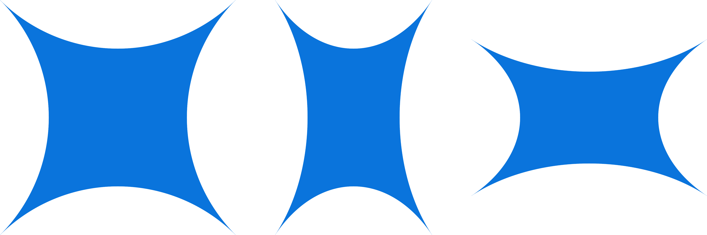

[<- Back](../README.md)

# FAQ

### 1. Which mapping should I use?

The following four mappings are recommended for anyone new to Circular Area. It is recommended to try at least one forward mapping and one inverse mapping.

- Forward mappings: [FG-Squircular Mapping](./mappings/fg_squircular_mapping.md) or [Elliptical Grid Mapping](./mappings/elliptical_grid_mapping.md).

- Inverse mappings: [FG-Squircular Mapping Inverse](./mappings/fg_squircular_mapping.md) or [Elliptical Grid Mapping Inverse](./mappings/elliptical_grid_mapping.md).

For more information on mappings see: [Layman's Guide to Circular Area](./layman_s_guide_to_circular_area.md) and [Mappings Index](./mappings_index.md).

 

### 2. What benefits does a circular area have over a rectangular area?

See: [Why you should use circular area](./layman_s_guide_to_circular_area.md)

 

### 3. Circular Area has lots of distortion. Wouldn't that make it harder to use?

The distortion is by design, and without this distortion there would be no benefits to using a circular area.

It may look hard to use, but it's easier than it appears. See below:

 

### 4. It must take a long time or a lot of practice to get used to playing like this, right?

No. As surprising as it may seem, you can get almost entirely accustomed to Circular Area in a day or two. However, it can take around a week or longer to become completely comfortable with Circular Area.

 

### 5. Does it really make my area circular?

Yes. Circular Area transforms your tablet area into either an ellipse or a half-face superellipse depending on the mapping type. See below:

For more information on mapping types see: [Forward vs Inverse Mappings](./layman_s_guide_to_circular_area.md)

 

### 6. OpenTabletDriver doesn't show my area as an ellipse or half-face superellipse. Is the plugin broken?

No. Circular Area transforms your tablet area in the backend only. There will be no visual changes within OTD's GUI/UX. Currently, OTD does not allow plugins to change GUI. If OTD makes this option available in the future, Circular Area will make use of it.

 

### 7. Can I enable multiple mappings?

Yes. There will not be any errors if you enable multiple mappings. However, it is not recommended to do so. See: [Multiple Mappings](./layman_s_guide_to_circular_area.md)

 

### 8. Can I mix between two different mappings? I like different parts of two mappings is it possible to combine them?

Yes. Use tertiary mappings. See: [Tertiary Mapping Styles](./layman_s_guide_to_circular_area.md)

However, some mappings cannot be mixed between because they are too far unrelated.

 

### 9. Are there any mappings that make my area a squircle or only somewhat circular?

Yes, using the truncation option in [Circular Control Panel](./circular_control_panel.md) some forward mappings will become a squircle.

 

### 10. If I spin my pen in a circular motion will the cursor spin in a rectangular motion?

Usually, no. However, it is possible to do this with [Simple Stretch-based mappings](./mappings_index.md).

 

### 11. When I disable `Clamp input outside area` in OTD, it stays clamped when using Circular Area. Is there something wrong with the plugin?

No, Circular Area applies its own clamping to input due to constraints in the mapping calculations. The cursor will stay locked inside the set monitor area while Circular Area is active. You should increase your monitor area if you need to reach beyond your current monitor area.