[<- Back](../README.md)

# Layman's Guide to Circular Area

For basic setup and simple questions, read the [Quick Start Guide](../README.md#quick-start-guide) or [FAQ](./FAQ.md) instead of this guide.

This guide simplifies various concepts down to how they effectively work from the perspective of the user. 

Many parts of Circular Area work in more complex ways but are simplified to minimize confusion.

## Why you should use Circular Area

Rectangles are unnatural to the wrists and fingers. The natural full range of motion of your wrists and fingers is circular. 

Forward mappings match this natural motion by making the tablet area an ellipse. This creates a feeling of evenness when reaching for any point on the tablet area and removes strain caused by reaching for corners on a rectangular area.

Inverse mappings make the tablet area a half-face superellipse. These are useful for an entirely different reason than forward mappings. When gripping a tablet pen, it should be the most stable to move around the center of the tablet area. This stability decreases when reaching for the corners of the tablet area. Inverse mappings compensate for this by effectively increasing the tablet area when moving to the corners.

For more information on how forward and inverse mappings work, see below:

 

## Forward vs Inverse Mappings

### Forward Mappings:

- Forward mappings are any mappings that do not include "inverse" in their name. 

- These mappings make the tablet area an ellipse, transform its proportions based on the tablet area, then map it to the rectangular monitor area.

- Forward mappings will decrease the physical distance required to move from one corner to another while keeping the side to side distance the same.

- Forward mapping area shape examples:

### Inverse Mappings:

- Inverse mappings are any mappings that include "inverse" in their name.

- These mappings make the tablet area a half-face superellipse, transform its proportions based on the tablet area, then map it to the rectangular monitor area.

- Inverse mappings will decrease the physical distance required to move from one side to another while keeping the corner-to-corner distance the same.

- Inverse mapping area shape examples:

 

## [Mappings Index](./mappings_index.md)

The [Mappings Index](./mappings_index.md) contains a list of all the mapping pages in Circular Area. Mapping pages include visualizations and formulas for each mapping and its inverse.

Below are explanations of these mappings:

 

## Primary Mapping Styles

These are the mappings all other mappings are based off. This applies to both forward and inverse mappings, unless explicitly stated otherwise.

### [FG-Squircular Mapping:](./mappings/fg_squircular_mapping.md)

- When moving straight outwards from the center, the input will always stay straight.

- Movement around the center of the area will feel almost the same as a rectangular area, and more distorted towards the edges.

- Secondary mapping types allow for lots of customizability in how the distortion is handled. Different parts of areas can have more or less distortion depending on the mapping.

### [Elliptical Grid Mapping:](./mappings/elliptical_grid_mapping.md)

- When moving straight outwards from the center, the input will curve towards the corner-to-corner diagonals or the axes depending on whether the mapping is forward or inverse, respectively.

- Movement around the center of the area will feel almost the same as a rectangular area, and more distorted towards the edges.

- Secondary mapping types have the option to add more distortion towards the corners or distribute distortion axially. Axial distribution of the distortion stretches either the X or Y axis (Horizontal or Vertical) more than the other axis.

### [Simple Stretch:](./mappings/simple_stretch.md)

- Moving straight outwards from the center, the input will always stay straight.

- Moving around any part of the area and crossing any line of symmetry will make input change direction, often unexpectedly to the user. The lines of symmetry are the X and Y axis, as well as the corner-to-corner diagonals.

- Secondary mapping types distribute distortion axially in different ways. These mappings will feel very similar to the user. Axial distribution of the distortion stretches either the X or Y axis (Horizontal or Vertical) more than the other axis.

### [Lamé-based Mappings:](./mappings/lam%C3%A9_based_mappings.md)

Note: These mappings are not direct counterparts of each other. Lamé-based Mappings cannot be explicitly reversed.

- Forward mapping: 
    - When moving straight outwards from the center, the input will curve towards the corners to an extreme extent.
    - On small areas or low/medium LPI tablets, input will jump when crossing the axes far from the center due to the extreme distortion.
    - Movements get faster non-linearly towards the corners and sides of the area.

- Inverse mapping:
    - When moving straight outwards from the center, the input will always stay straight. But, when offset towards any corner, input will bubble outwards towards that corner.
    - On small areas or low/medium LPI tablets, input will jump when crossing the axes near the center due to the extreme distortion.
    - Movements get slower non-linearly towards the corners and sides of the area.

### [p-Norm Squicular Mapping](./mappings/p_norm_squircular.md)

Note: This mapping only has a forward variant.

- Moving straight outwards from the center, the input will always stay straight.

- When `m` is 1, the mapping is in its neutral state. Movement around the center of the area will feel almost the same as a rectangular area, and more distorted towards the edges.

- When `m` is less than 1 the distorsion affects more of the center and distorts less heavily towards the corners and sides of the area. Low `m` values create distortion similar to Simple Stretch.

- When `m` is greater than 1 the distorsion affects less of the center and distorts more heavily towards the corners and sides of the area. High `m` values create distortion similar to 2-Squircular or 3-Squircular mappings.

 

## Secondary Mapping Styles

These mappings are based off and will be compared to their respective primary mappings.

### [FG-Squircular Mapping](./mappings/fg_squircular_mapping.md) based:

- **[2-Squircular Mapping](./mappings/2_squircular_mapping.md) and [3-Squircular Mapping](./mappings/3_squircular_mapping.md)**
    - Forward mappings: Far corners pull the cursor more. The middle and sides distort less. 3-Squircular Mapping does this slightly more than 2-Squircular Mapping.
    - Inverse mappings: Excluding the axes, the sides and corners pull inwards less. Also excluding the axes, the corners are further away relative to the sides. 3-Squircular Mapping does this slightly more than 2-Squircular Mapping.

- **[Cornerific Tapered2 Mapping](./mappings/cornerific_tapered2_mapping.md), [Tapered3 Mapping](./mappings/tapered3_mapping.md), and [Tapered1.5 Mapping](./mappings/tapered1_5_mapping.md)**
    - Forward mappings: Far corners pull the cursor less. The middle and sides distort more. Tapered1.5 Mapping does this slightly more than Cornerific Tapered2 Mapping and Tapered3 Mapping.
    - Inverse mappings: Excluding the axes, the sides and corners pull inwards more. Also excluding the axes, the corners are closer relative to the sides. Tapered1.5 Mapping does this slightly more than Cornerific Tapered2 Mapping and Tapered3 Mapping.
    

- **[Non-Axial 2-Pinch Mapping](./mappings/non_axial_2_pinch_mapping.md)**
    - Forward mapping: The middle of the area is a lot faster than the sides and corners. Far corners pull the cursor a lot less. The sides distort a lot less. On small areas or low/medium LPI tablets, input will jump when crossing the axes near the center due to the extreme distortion.
    - Inverse mapping: The middle of the area is a lot slower than the sides and corners. Excluding the axes, the sides and corners pull inwards a lot less.
    

- **[Non-Axial ½-Punch Mapping](./mappings/non_axial_half_punch_mapping.md)**
    - Forward mapping: The middle of the area is a lot slower than the sides and corners. Far corners pull the cursor a lot more. The sides distort a lot more.
    - Inverse mapping: The middle of the area is a lot faster than the sides and corners. Excluding the axes, the sides and corners pull inwards a lot more. On small areas or low/medium LPI tablets, input will jump when crossing the axes near the center due to the extreme distortion.

- **[Sham Quartic Mapping](./mappings/sham_quartic_mapping.md)**
    - Forward mapping: The middle of the area is slightly slower than the sides and corners. The corners pull the cursor to an extreme extent. The far sides pull the cursor a lot more.
    - Inverse mapping: The middle of the area is faster than the sides and corners. Excluding the axes, the sides and corners pull inwards less. Also excluding the axes, the corners are further away relative to the sides.

### [Elliptical Grid Mapping](./mappings/elliptical_grid_mapping.md) based:

 - **[Squelched Grid Open Mapping](./mappings/squelched_grid_open_mapping.md)**
    - Forward mapping: Corner-to-corner diagonals pull the cursor more from all positions. This effect is strengthened closer to the sides and corners.
    - Inverse mapping: Axes pull the cursor more from all positions. This effect is strengthened closer to the sides and corners.
    

- **[Vertical Squelch Open Mapping](./mappings/vertical_squelch_open_mapping.md)**
    - Forward mappings: Corner-to-corner diagonals pull the cursor more from the X-axis and less from the Y-axis. This effect is strengthened closer to the sides and corners.
    - Inverse mappings: Axes pull the cursor more from the X-axis and less from the Y-axis. This effect is strengthened closer to the sides and corners.

- **[Horizontal Squelch Open Mapping](./mappings/horizontal_squelch_open_mapping.md)**
    - Forward mappings: Corner-to-corner diagonals pull the cursor more from the Y-axis and less from the X-axis. This effect is strengthened closer to the sides and corners.
    - Inverse mappings: Axes pull the cursor more from the Y-axis and less from the X-axis. This effect is strengthened closer to the sides and corners.

### [Simple Stretch](./mappings/simple_stretch.md) based:

- **[Concentric Mapping](./mappings/concentric_mapping.md)**
    - Forward mapping: On the X-axis, input will be offset towards the corner-to-corner diagonals more. On the Y-axis, input will be offset towards the axes more.
    - Inverse mapping: On the Y-axis input will be offset towards the corner-to-corner diagonals more. On the X-axis, input will be offset towards the axes more. Excluding the axes, the corners are further away relative to the sides.
    

- **[Approximate Equal Area](./mappings/approximate_equal_area.md)**
    - Forward mapping: On the Y-axis, input will be offset towards the corner-to-corner diagonals more. On the X-axis, input will be offset towards the axes more.
    - Inverse mapping: On the X-axis, input will be offset towards the corner-to-corner diagonals more. On the Y-axis, input will be offset towards the axes more. Excluding the axes, the corners are further away relative to the sides.
    

- **[Approximate Equal Area 2 Vertical](./mappings/approximate_equal_area_2_vertical.md)**
    - Forward mapping: On the Y-axis, input will be offset towards the corner-to-corner diagonals more. On the X-axis, input will be offset towards the axes more.
    

- **[Approximate Equal Area 2 Horizontal](./mappings/approximate_equal_area_2_horizontal.md)**
    - Forward mapping: On the Y-axis, input will be offset towards the axes more. On the X-axis, input will be offset towards the corner-to-corner diagonals more.

 

## Tertiary Mapping Styles

These mappings mix between primary and secondary mappings. Changing the value of `β` changes the mixing of primary or secondary mappings. `β` accepts any value from 0 to 1.

Below are `β` values where tertiary mappings match primary or secondary mappings.

### [FG-Squircular Mapping](./mappings/fg_squircular_mapping.md) based:

- **[Power2 Blend](./mappings/power2_blend.md)**
    - 2-Squircular Mapping: β = 0
    - FG-Squircular Mapping: β = 0.5
    - Cornerific Tapered2 Mapping: β = 1

- **[Power3 Blend](./mappings/power3_blend.md)**
    - 3-Squircular Mapping: β = 0
    - FG-Squircular Mapping: β = 0.66
    - Tapered3 Mapping: β = 1

### [Elliptical Grid Mapping](./mappings/elliptical_grid_mapping.md) based:

- **[Blended E-Grid Mapping](./mappings/blended_e_grid_mapping.md)**
    - Squelched Grid Open Mapping: β = 0
    - Elliptical Grid Mapping: β = 1

- **[Biased Squelch Blended Mapping](./mappings/biased_squelch_blended_mapping.md)**
    - Vertical Squelch Open Mapping: β = 0
    - Elliptical Grid Mapping: β = 0.5
    - Horizontal Squelch Open Mapping: β = 1

- **[Biased Squelch Vertical](./mappings/biased_squelch_vertical.md)**
    - Vertical Squelch Open Mapping: β = 0
    - Squelched Grid Open Mapping: β = 1

- **[Biased Squelch Horizontal](./mappings/biased_squelch_horizontal.md)**
    - Horizontal Squelch Open Mapping: β = 0
    - Squelched Grid Open Mapping: β = 1

 

## Quaternary Mapping Styles

These mappings mix between primary, secondary, and tertiary mappings. Changing the value of `m` changes the tertiary mapping to use. `m` accepts any value 0 and higher. Changing the value of `β` changes the mixing of primary or secondary mappings. `β` accepts any value from 0 to 1.

This can be used to create many mappings that do not exist on their own. For example, 200-Squircular using m = 200 and β = 0 or Tapered0.001 using m = 0.001 and β = 1.

Below are `m` values matching existing tertiary mappings.

### [FG-Squircular Mapping](./mappings/fg_squircular_mapping.md) based:

- **[Power-m Blend](./mappings/power_m_blend.md)**
    - Power2: m = 2
    - Power3: m = 3

 

## Multiple Mappings

Circular area filtering is not restricted to using one mapping at a time. It is not recommended to use multiple mappings, and usually the results of applying multiple mappings are not desirable, but it is possible.

The below diagrams show the shape of the tablet area with various mappings applied up to three times.

### Forward Mappings

**[FG-Squircular Mapping:](./mappings/fg_squircular_mapping.md)**

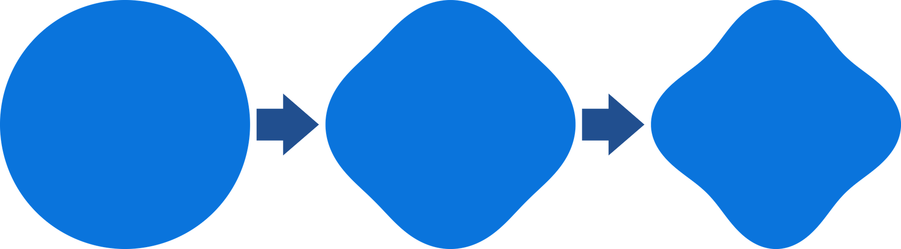

**[3-Squircular Mapping:](./mappings/3_squircular_mapping.md)**

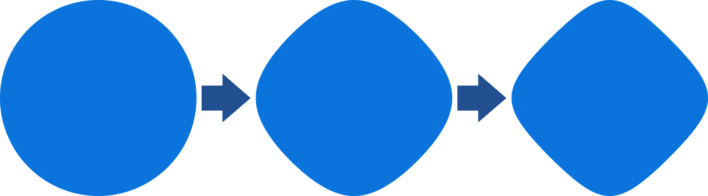

**[Cornerific Tapered2 Mapping:](./mappings/cornerific_tapered2_mapping.md)**

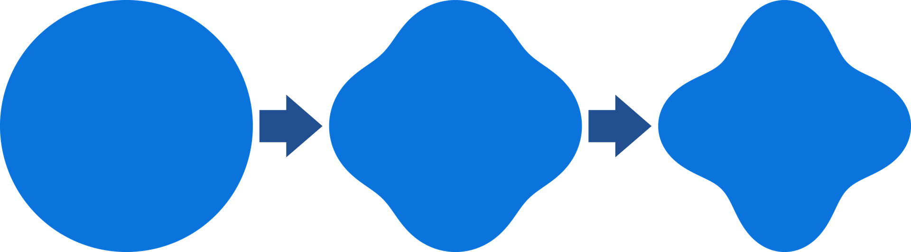

**[Elliptical Grid Mapping:](./mappings/elliptical_grid_mapping.md)**

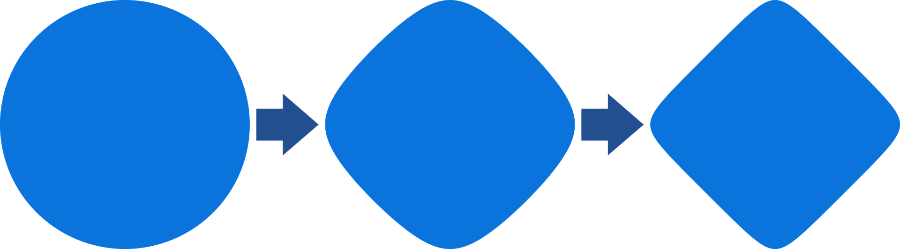

**[Squelched Grid Open Mapping:](./mappings/squelched_grid_open_mapping.md)**

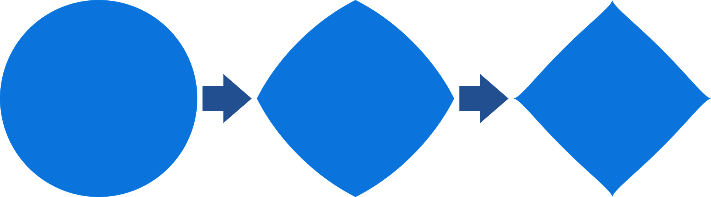

**[Simple Stretch:](./mappings/simple_stretch.md)**

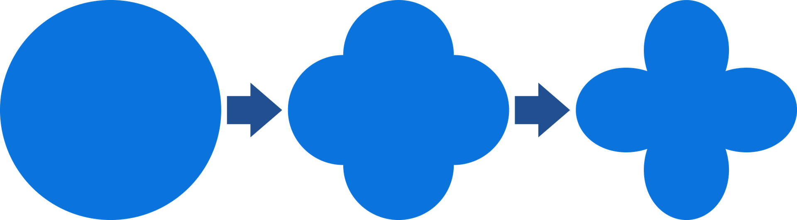

### Inverse Mappings

**[FG-Squircular Mapping Inverse:](./mappings/fg_squircular_mapping.md)**

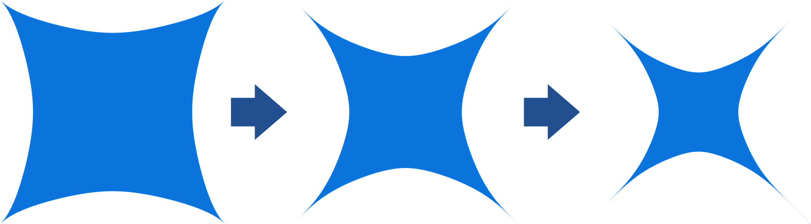

**[3-Squircular Mapping Inverse:](./mappings/3_squircular_mapping.md)**

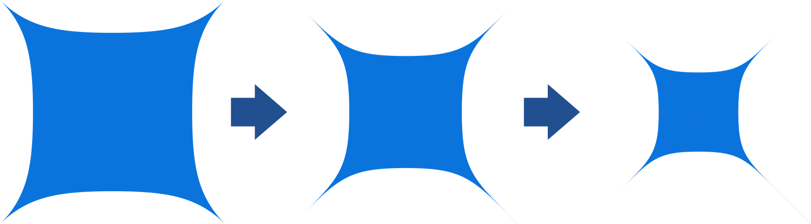

**[Cornerific Tapered2 Mapping Inverse:](./mappings/cornerific_tapered2_mapping.md)**

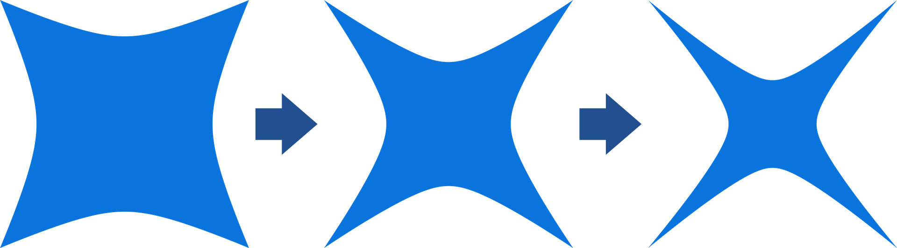

**[Elliptical Grid Mapping Inverse:](./mappings/elliptical_grid_mapping.md)**

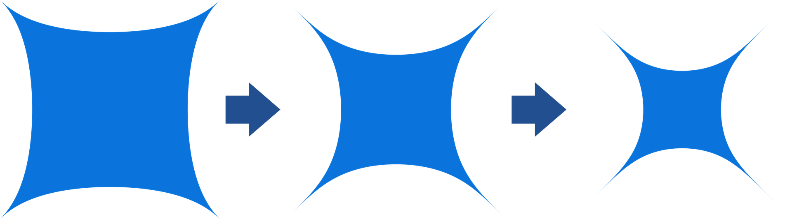

**[Squelched Grid Open Mapping Inverse:](./mappings/squelched_grid_open_mapping.md)**

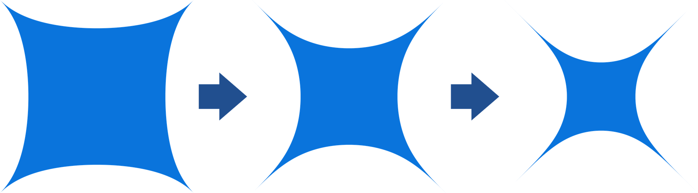

**[Simple Stretch Inverse:](./mappings/simple_stretch.md)**

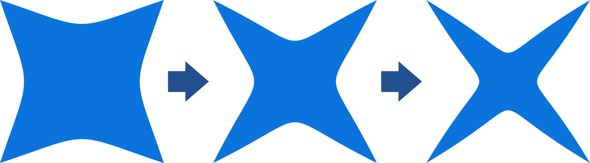

 

## Circular Control Panel

Circular Control Panel is a filter that can be used to control various advanced options about Circular Area mappings.

See: [Circular Control Panel](./circular_control_panel.md)