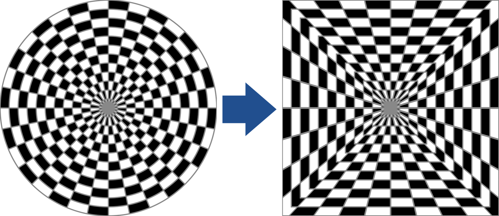
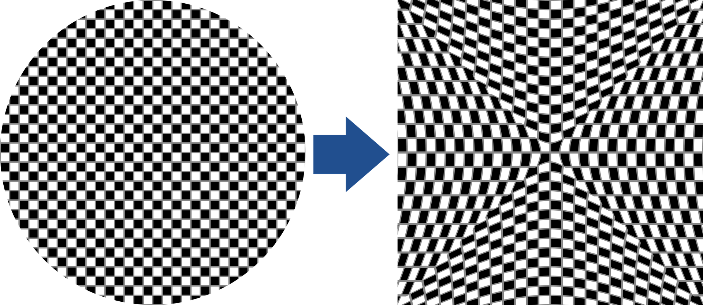
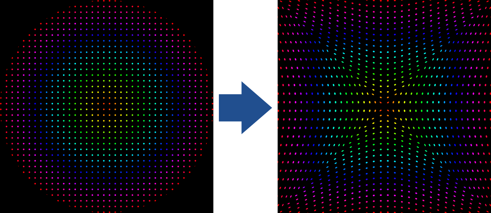
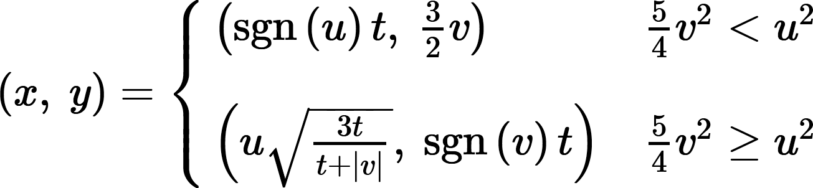
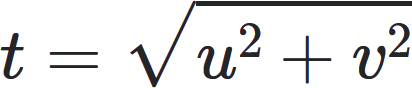

[<- Back](../mappings_index.md)

# Approximate Equal Area 2 Horizontal

## Diagrams

## Formula

# Approximate Equal Area 2 Horizontal Inverse 

Note: This mapping is unusable to such a degree that it has been excluded from the plugin.