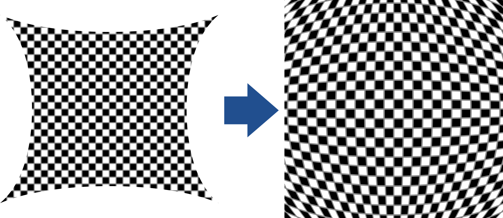

[<- Back](../mappings_index.md)

# Biased Squelch Horizontal

## Diagrams
#### β = 0 [(Horizontal Squelch Open Mapping)](./horizontal_squelch_open_mapping.md)

#### β = 0.25

#### β = 0.33

#### β = 0.5

#### β = 0.66

#### β = 0.75

#### β = 1 [(Squelched Grid Open Mapping)](./squelched_grid_open_mapping.md)

## Formula

# Biased Squelch Horizontal Inverse

## Diagrams
#### β = 0 [(Horizontal Squelch Open Mapping Inverse)](./horizontal_squelch_open_mapping.md)

#### β = 0.25

#### β = 0.33

#### β = 0.5

#### β = 0.66

#### β = 0.75

#### β = 1 [(Squelched Grid Open Mapping Inverse)](./squelched_grid_open_mapping.md)

## Formula

Note: Inverse mapping outputs are upscaled by ≈1.4142 to fill the entire monitor area. The inverse mapping formula shown here excludes this.