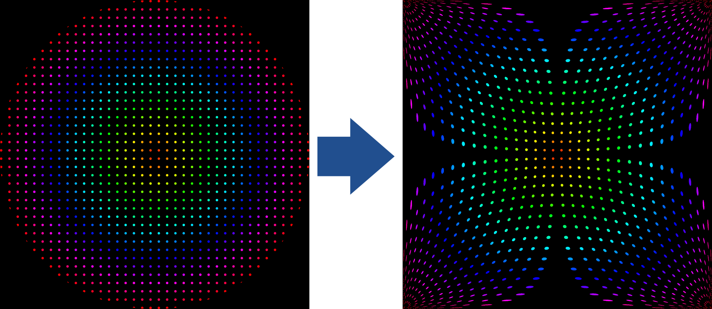

[<- Back](../mappings_index.md)

Notes: 
- These mappings are not counterparts to one another. Lamé-based Mappings do not have direct inverses. These two mappings are distinctly different.

# Lamé-based Mapping

## Diagrams

## Formula

# Lamé-based Mapping Inverse

## Diagrams

## Formula

Note: Inverse mapping outputs are upscaled by ≈1.4142 to fill the entire monitor area. The inverse mapping formula shown here excludes this.