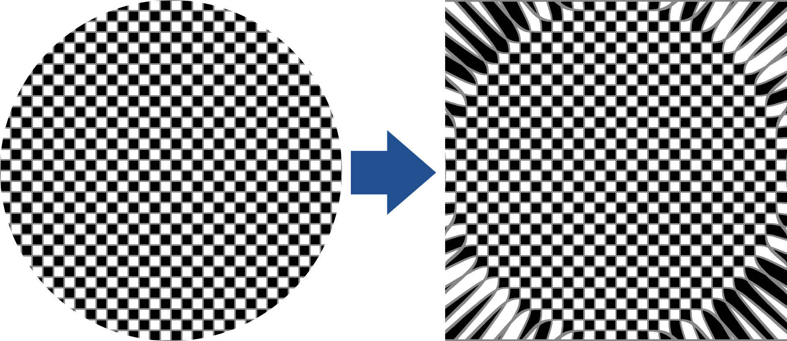

[<- Back](../mappings_index.md)

Notes: 
- p-Norm Squicular Mapping does not have an inverse.

# p-Norm Squicular Mapping

#### m = 0.01

#### m = 0.1

#### m = 0.5

#### m = 1

#### m = 5

#### m = 10

#### m = 100

## Formula

