[<- Back](../mappings_index.md)

# Power3 Blend

## Diagrams
#### β = 0 [(3-Squircular Mapping)](./3_squircular_mapping.md)

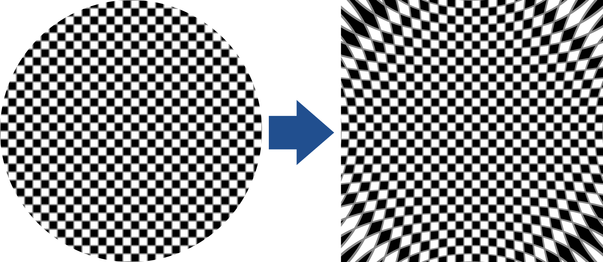
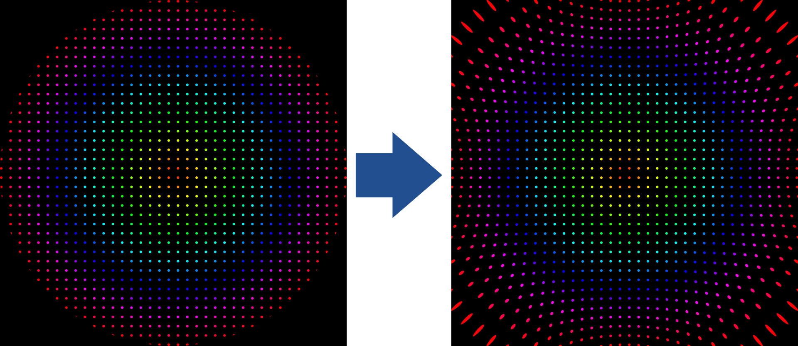

#### β = 0.25

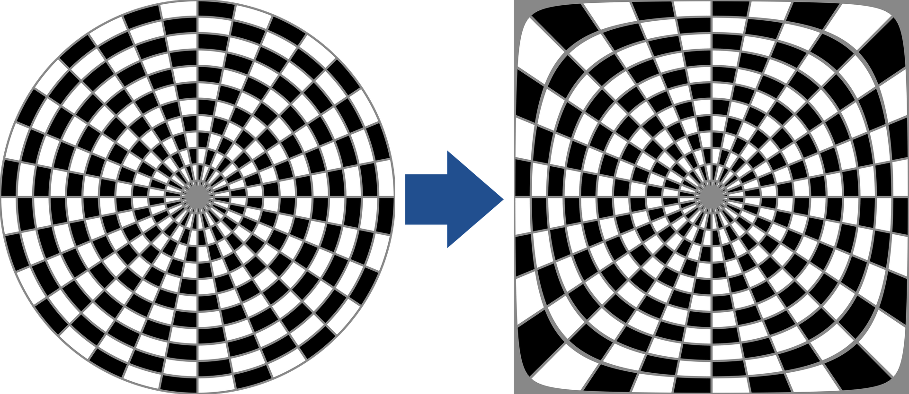

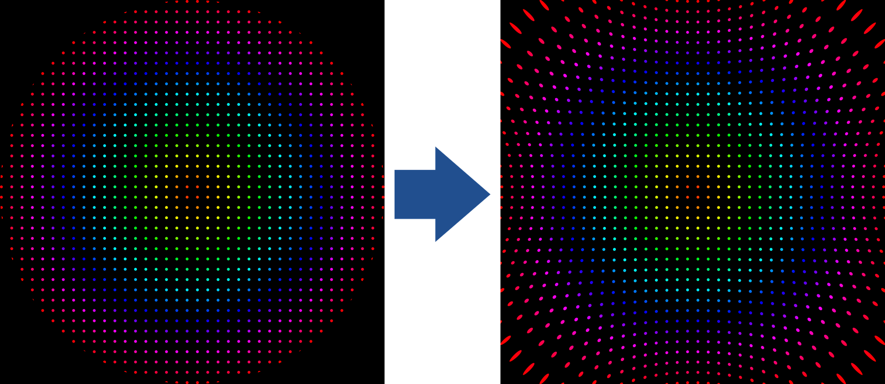

#### β = 0.33

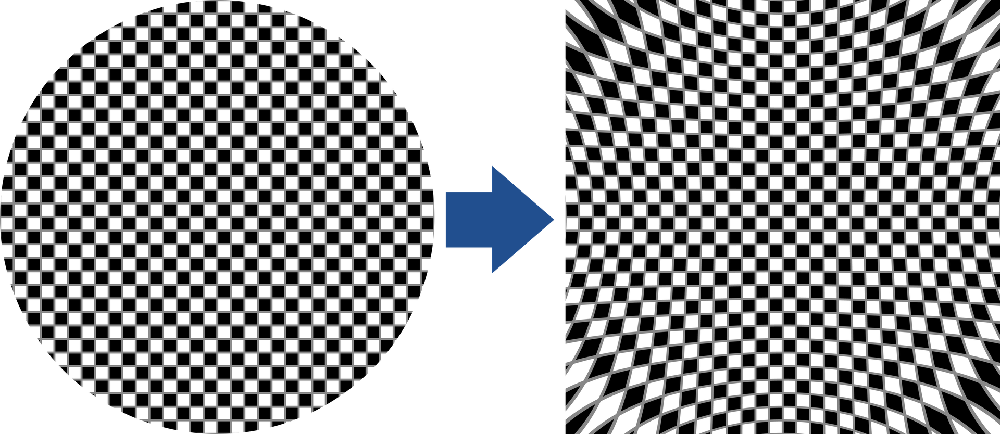
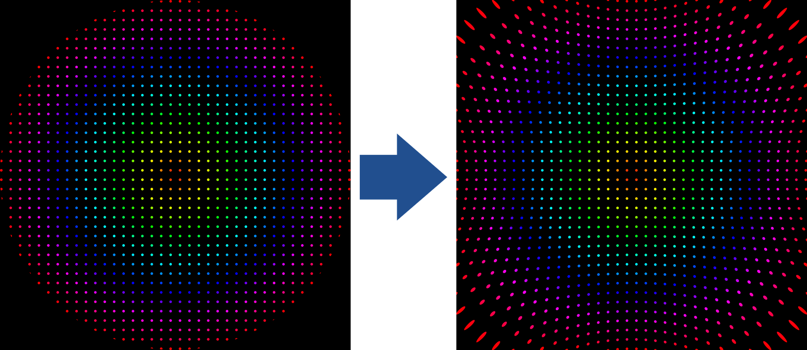

#### β = 0.5

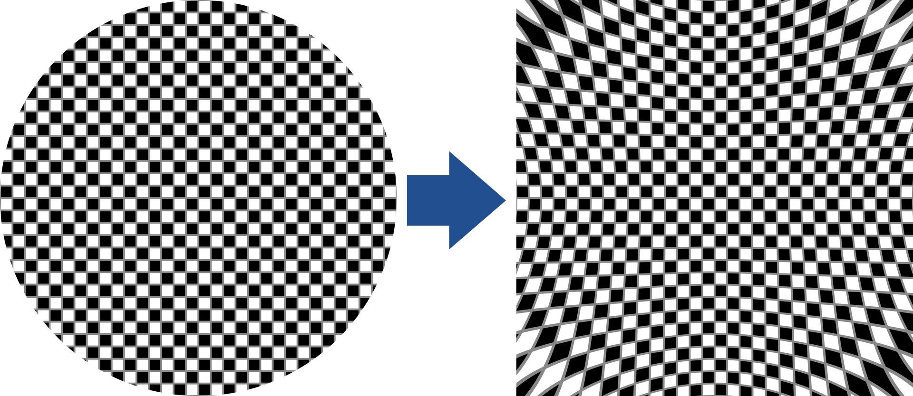
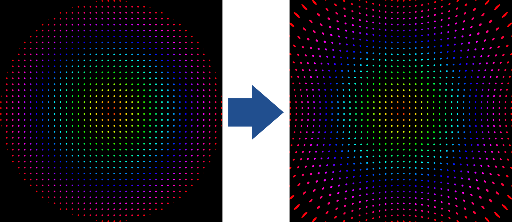

#### β = 0.66 [(FG-Squircular Mapping)](./fg_squircular_mapping.md)

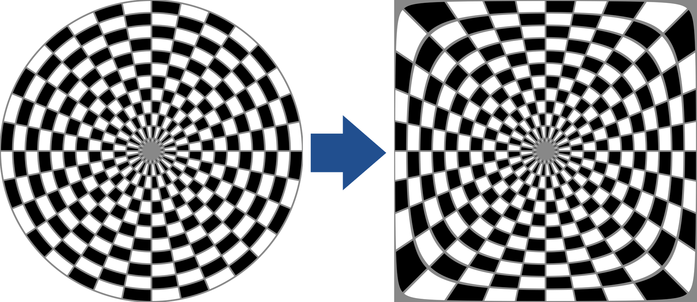

#### β = 0.75

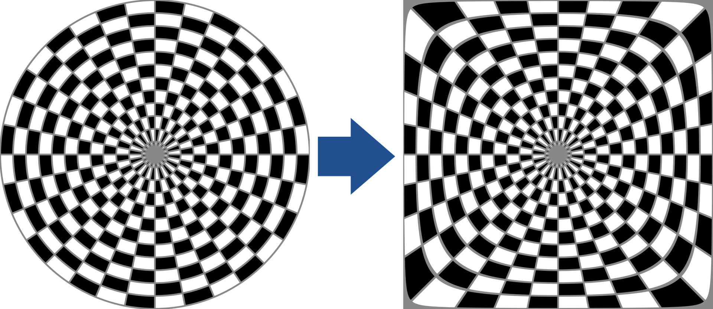
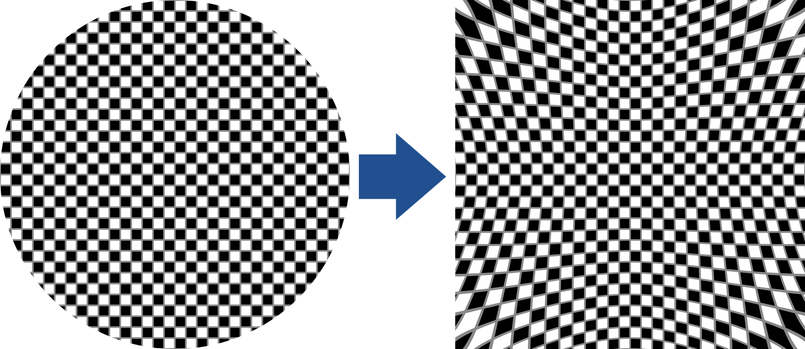

#### β = 1 [(Tapered3 Mapping)](./tapered3_mapping.md)

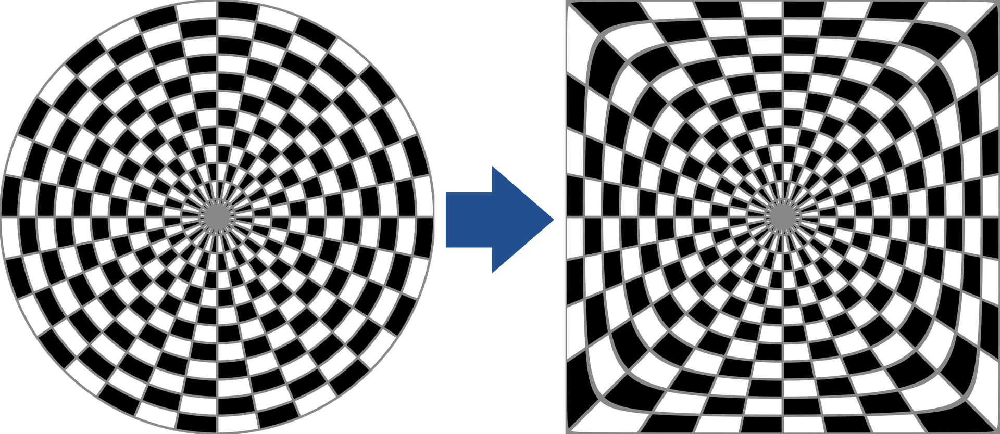
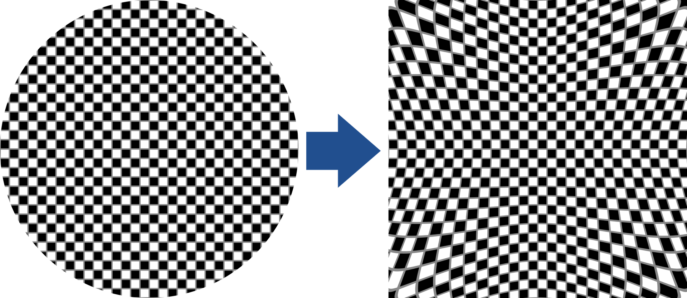
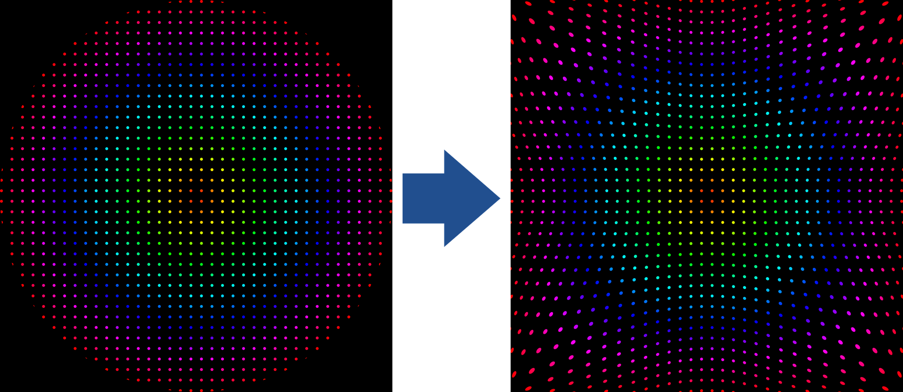

## Formula
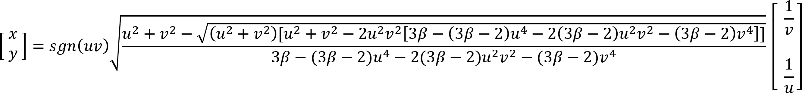

# Power3 Blend Inverse

## Diagrams
#### β = 0 [(3-Squircular Mapping Inverse)](./3_squircular_mapping.md)

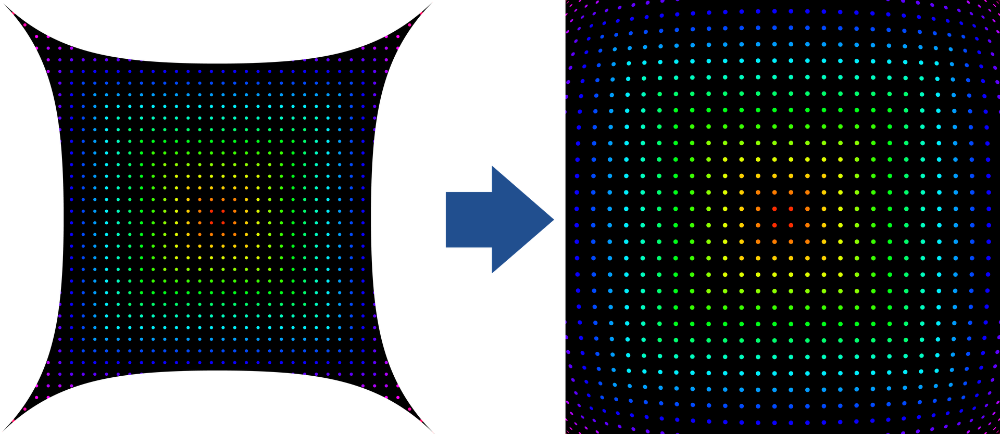

#### β = 0.25

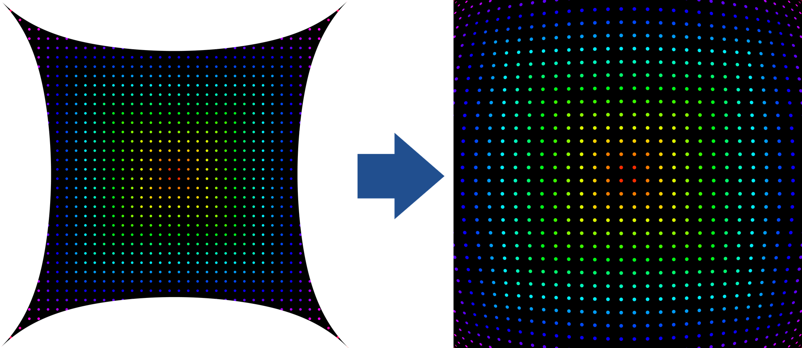

#### β = 0.33

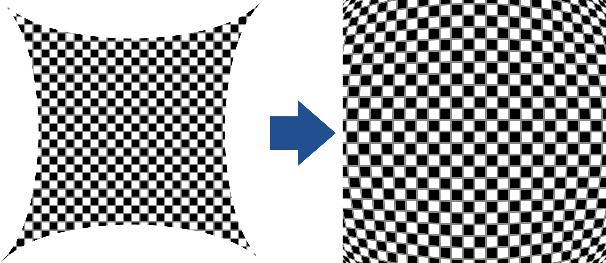
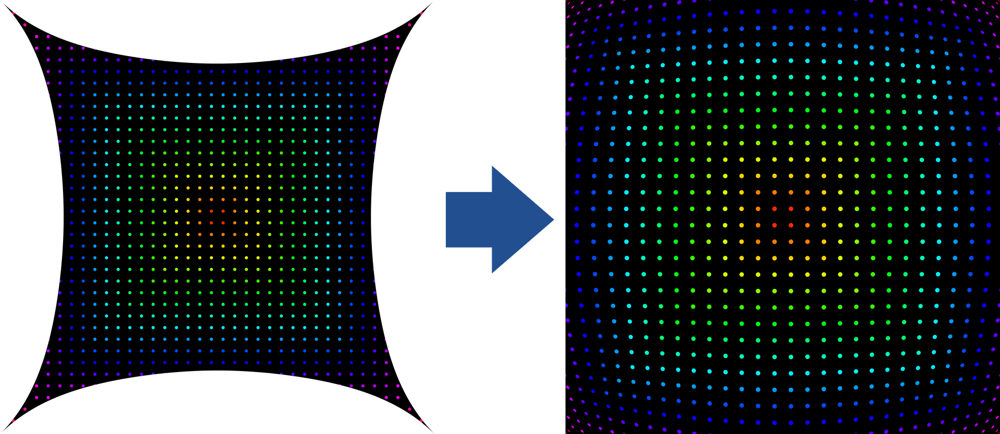

#### β = 0.5

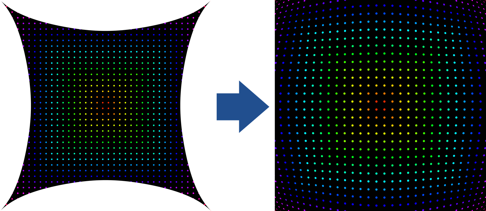

#### β = 0.66 [(FG-Squircular Mapping Inverse)](./fg_squircular_mapping.md)

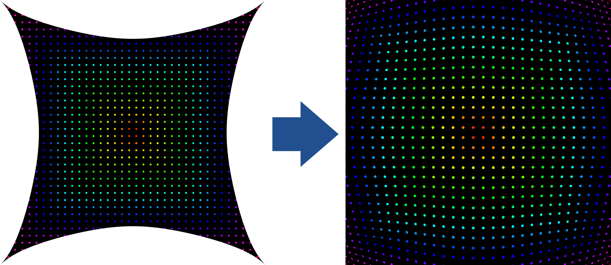

#### β = 0.75

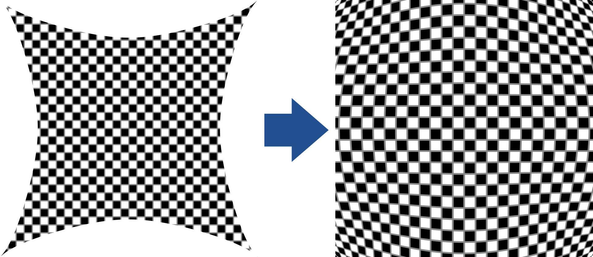
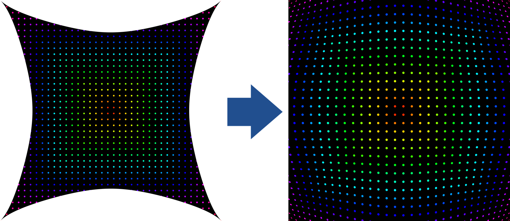

#### β = 1 [(Tapered3 Mapping Inverse)](./tapered3_mapping.md)

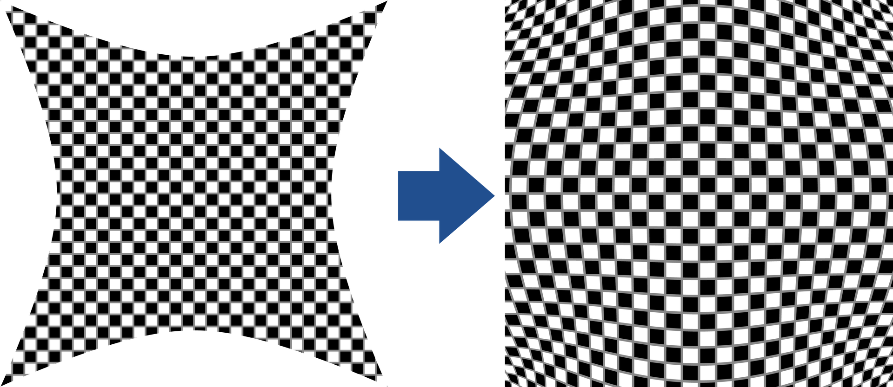

## Formula
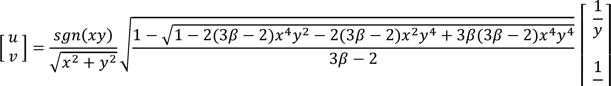

Note: Inverse mapping outputs are upscaled by ≈1.4142 to fill the entire monitor area. The inverse mapping formula shown here excludes this.