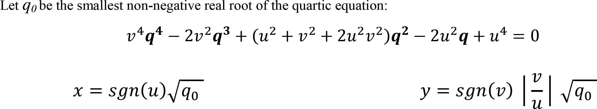
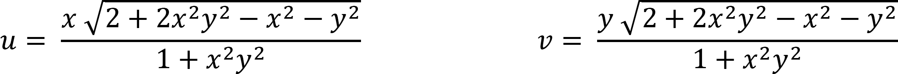

[<- Back](../mappings_index.md)

Note: Due to incompatibility with my diagram generation methods these mappings currently do not have diagrams. This page may be completed in the future.

# Sham Quartic Mapping

## Formula

# Sham Quartic Mapping Inverse

## Formula

Note: Inverse mapping outputs are upscaled by ≈1.4142 to fill the entire monitor area. The inverse mapping formula shown here excludes this.