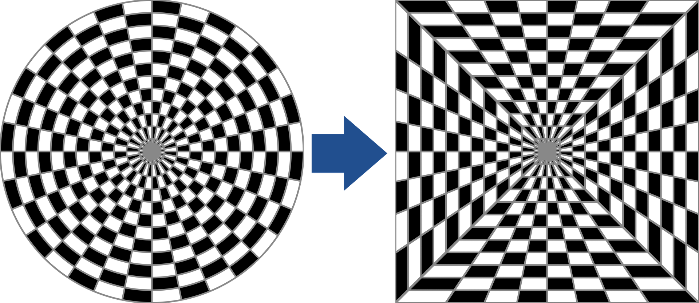
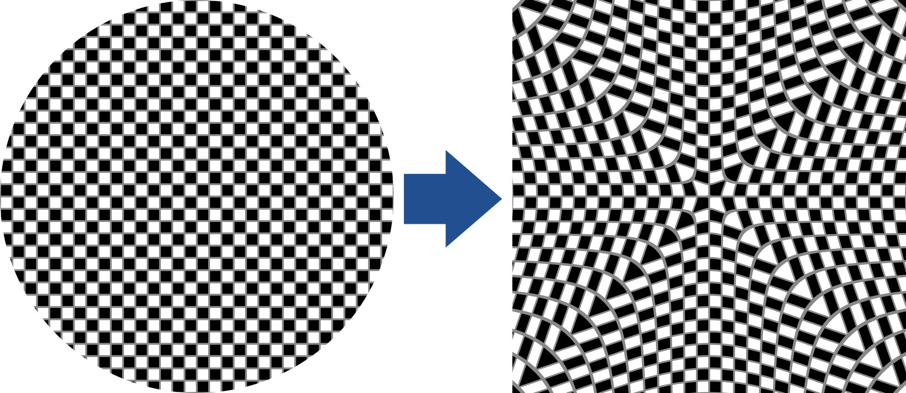
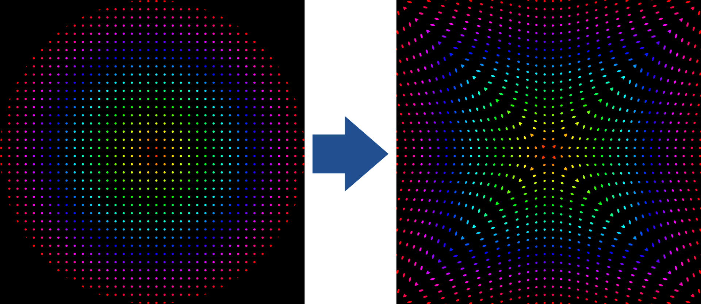
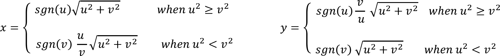
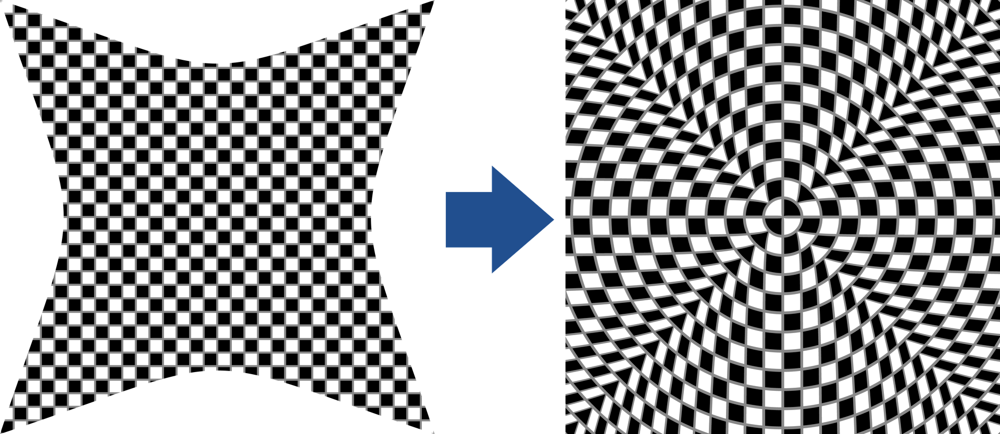
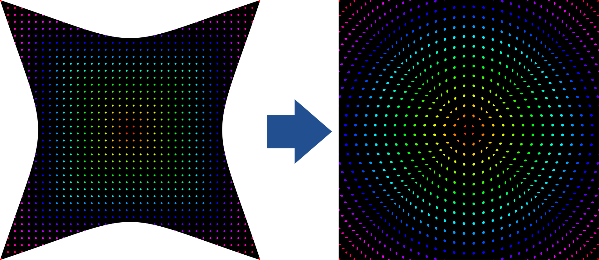
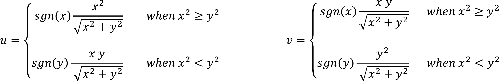

[<- Back](../mappings_index.md)

# Simple Stretch

## Diagrams

## Formula

# Simple Stretch Inverse

## Diagrams

## Formula

Note: Inverse mapping outputs are upscaled by ≈1.4142 to fill the entire monitor area. The inverse mapping formula shown here excludes this.