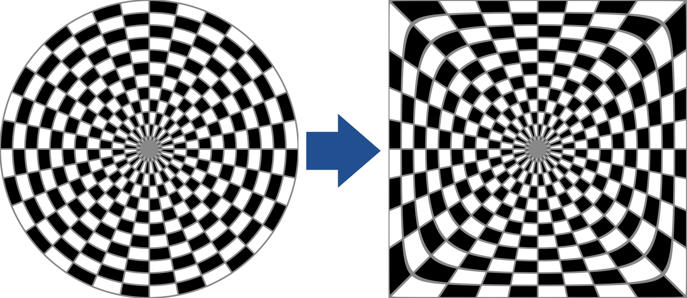
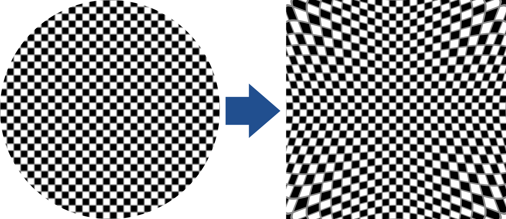
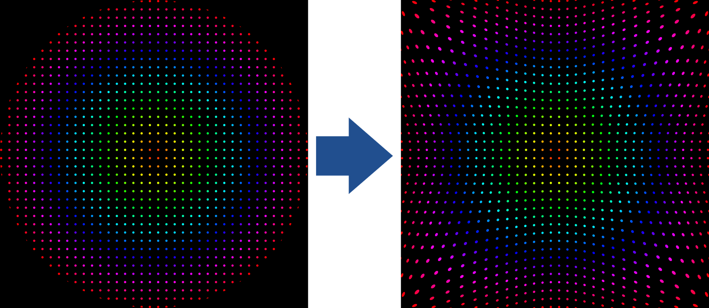
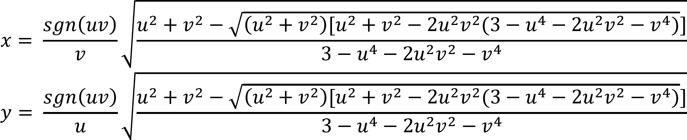
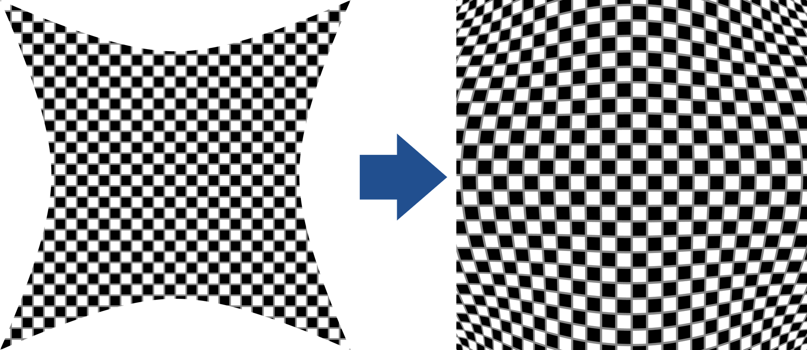
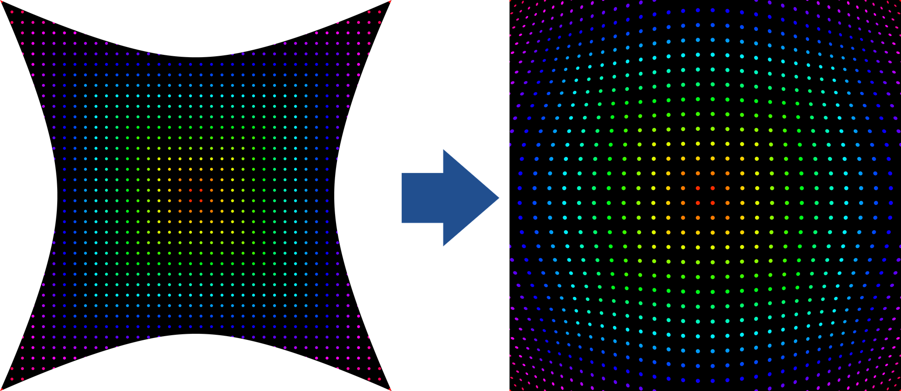
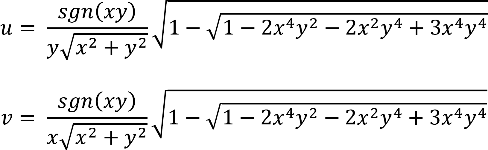

[<- Back](../mappings_index.md)

Note: These mappings were originally named "Tapered4" by their creator. They have been renamed to "Tapered3" for clarity and consistency.

# Tapered3 Mapping

## Diagrams

## Formula

# Tapered3 Mapping Inverse

## Diagrams

## Formula

Note: Inverse mapping outputs are upscaled by ≈1.4142 to fill the entire monitor area. The inverse mapping formula shown here excludes this.